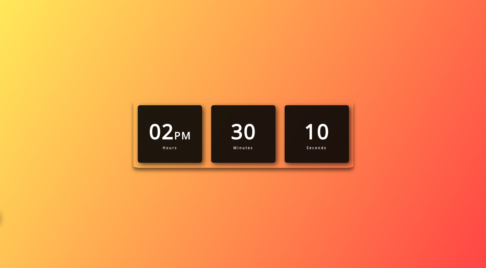

# Digital Clock with Ripple Effect

- This project is a simple digital clock with a mesmerizing ripple effect. It displays the current time in hours, minutes, and seconds, providing a visually pleasing experience.

## Features

- Real-time display of hours, minutes, and seconds.
- Ripple effect background for a captivating visual experience.

## Contributing

Contributions are welcome! If you'd like to improve this digital clock or add new features, feel free to fork the repository and submit a pull request.

## License

This project is licensed under the MIT License. See the LICENSE file for details.

By Welberthy Gustavo
